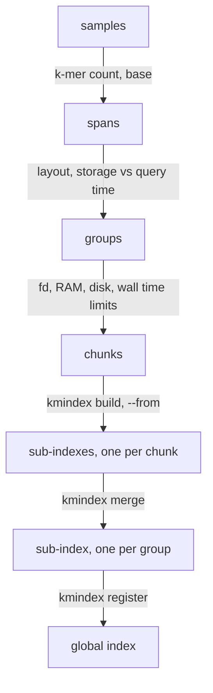

# Review of `performances.md`: verified formulas and experiment plan for the SRA-2025 index

Scope: check every formula and assertion of `claude/performances.md` against the code, the
documentation and the papers, extract the parameters that drive each metric, and define
the experiments needed to choose the chunk/merge strategy for a ~40M-sample index on TACC
Vista. Helper scripts are in `claude/scripts/` (see section 13).

Verdict codes used below: `EXACT` (matches the code), `BOUND` (safe over-estimate),
`APPROX` (right drivers, constant to be measured), `WRONG` (contradicted by the code),
`OPEN` (cannot be concluded without an experiment).

## Where to find what

| Looking for | Section |
| --- | --- |
| Versions, sources, notation, terms along the sample axis (sample, span, group, chunk, sub-index, global index) and the hash axis (partition), and the flowchart between them | 0 |
| "What to conclude" blocks (one per section) | 1.1, 2.4, 3.5, 4.1, 5.1, 6.4, 7.3, 11.1 |
| What `kmindex build` forwards to kmtricks, automatic partitions, pipeline order | 1 |
| Open files per stage (build, kmtricks merge, kmindex merge, query), soft vs hard limit | 2.1, 2.2 |
| Temp file count, mmap count | 2.3 |
| Build peak RAM: count stage formula ($K$, $P$, $T$) | 3.1 |
| Build peak RAM: kmtricks merge stage ($S$, $T$), missing from `performances.md` | 3.2 |
| Build peak RAM: other stages, corrected arrow table | 3.3, 3.4 |
| Build time model and reference numbers | 4 |
| `kmindex merge`: algorithm, cost vs number of chunks, constraints (`--from`, ids) | 5 |
| Query peak RAM (batch size, $S$, $z$) | 6.1 |
| Query time, effect of merging, threads | 6.2, 6.3 |
| Query conclusions: `-b` sizing table for the full SRA, does chunking matter for query | 6.4 |
| Index size formula, bits per k-mer, one-hash false positive rate | 7.1 |
| Peak temporary disk per chunk build, `kmindex merge` disk peak | 7.2 |
| Verdict on every statement of `performances.md` | 8 |
| Vista limits (known and to measure) | 9 |
| Experiments: data preparation and commands | 10 |
| E0 probe limits, E1 open files, E2 build RAM, E3 build time and temp disk | 10 |
| E4 merge vs chunks, E5 query, E6 end-to-end strategy, E7 compress | 10 |
| Chunking decision rule | 10 (E6) |
| Logan Pareto merge calculator: what it models and what it does not | 11 |
| Open points and flags | 12 |
| Scripts and usage examples | 13 |

## 0. Versions, sources and notation

Questions: which code is being checked, which sources are authoritative, are the
formulas still valid for the versions that will run on Vista.

| Item | Value | Source |
| --- | --- | --- |
| kmindex | 0.6.1 | `CMakeLists.txt:2` |
| kmtricks required by kmindex | >= 1.3.0 (binary found in `$PATH`) | `lib/include/kmindex/index/index.hpp:12` |
| kmtricks read here | v1.5.0 submodule (`thirdparty/kmtricks`); `git diff v1.5.0 v1.6.0` only adds BAM input (BankBam, `task.hpp`, `cli.cpp`), no change in count, merge, IO buffers or scheduling | submodule tags |
| GATB core | `thirdparty/kmtricks/thirdparty/gatb-core-stripped` | |
| kmhelpers | branch `dev/simplify-options` (`pykmhelpers/core/build_params.py`, `pykmhelpers/vendor/kmparams.py`) | |
| Papers | kmindex: Lemane et al., Nat. Comput. Sci. 4, 104-109 (2024). kmtricks: Lemane et al., Bioinformatics Advances 2022, doi 10.1093/bioadv/vbac029. findere: Robidou and Peterlongo, SPIRE 2021, doi 10.1007/978-3-030-86692-1_13 | READMEs |
| Docs | https://tlemane.github.io/kmindex/ (`construction/`, `merge/`, `query/`), https://docs.tacc.utexas.edu/hpc/vista/ | |

All kmtricks paths below are relative to `thirdparty/kmtricks/`, kmindex paths to the repo
root, kmhelpers paths to the kmhelpers repo on `dev/simplify-options`. A citation
written as `:lines` alone refers to the file of the previous citation.

Notation (same as `performances.md`, plus the symbols introduced in this report). A
symbol used only in one place is defined there; the ones below are used across sections.

Samples and k-mers:

| Symbol | Meaning |
| --- | --- |
| $S$ | samples in one kmtricks build (one chunk) |
| $S_{tot}$ | samples of the whole group being merged (sum over its chunks); $S_1$ samples of the first chunk, $S_g$ storage of group $g$ (section 11 only) |
| $C$ | number of chunks of a group; $G$ number of groups (two-level merge, 5.1); $N$ number of nodes building chunks in parallel (E6) |
| $K$ | k-mers of the largest sample of the build (occurrences, see 3.1); $K_{sample}$ the k-mers of one sample, $K_s$ of sample $s$ ($\sum_s K_s$ = total occurrences of the build), $\bar K$ their mean, $K_{max}$ the largest sample of a group (sets $B$) |
| $k$, $m$ | k-mer size (`-k/--kmer-size`, 25) and minimizer size (`-m/--minim-size`, 10); $\ell \approx (k-m+2)/2$ mean k-mers per super-k-mer (7.2) |
| $s$ | s-mer size, the k-mer size of the sub-index ($s = k$ of `-k/--kmer-size`, written $s$ in query formulas to match the code); $z$ findere z, queries look up $(s+z)$-mers but buffers are sized on $s$-mers (6.1). Also the sample index in $\sum_s K_s$ |
| $\beta$ | span base (kmhelpers, 2 by default): $\text{span} = \lfloor \log_\beta K_{sample} \rfloor$ |

Build parameters and limits:

| Symbol | Meaning |
| --- | --- |
| $P$ | partitions (`--nb-partitions`); $P_g$ partitions of group $g$ in the calculator (section 11) |
| $T$ | threads (`-t`); $T_{eff} = \min(T, \text{cores}, P)$ threads actually used by `kmindex merge` (2.1); $T_{max}$ thread ceiling of `get_best_params` (section 8) |
| $f$ | kmtricks focus (0.5): $\lfloor Tf \rfloor$ super-k-mer tasks in flight (2.1, 3.1); $n_w = \max(1, \lfloor Tf \rfloor)$ in `performances.md` |
| $B$ | Bloom filter size in bits (`--bloom-size`); $w = 64 \lceil \lceil B/P \rceil / 64 \rceil$ window (bits per partition per sample), $B_{eff} = wP \ge B$ the size actually stored (7.1) |
| $p$ | Bloom false positive rate; $f(p) = -\ln p / \ln^2 2$ bits per k-mer, $B = f(p) K_{max}$ (7.1); $p_n$ the boundaries of the bits-per-k-mer table. Also a partition index in 7.2 |
| $bw$ | bit width of the index (`--bitw`, 1 for presence/absence, only `--bloom-size` indexes here) |
| $F$ | open-file limit (soft `ulimit -n`, raised to the hard `ulimit -H -n`) |
| $R$ | RAM of the node; $M$ memory budget of the kmhelpers formulas (`performances.md`); $R_q$ RAM allowed for a query (6.4) |
| $\gamma$ | partition imbalance factor of the count stage (kmhelpers 1.05, GATB 1.2), to fit in E2 |
| $D_{in}$, $D_{scratch}$, $D_{peak}$ | input files on the run disk, temp disk available, temp disk peak (7.2); $\rho$ hash file size ratio with `--cpr`, $\sigma \in [0,1]$ fraction of super-k-mer files still present at the count-stage end (7.2). $\sigma$ is also the `safety_margin` of kmhelpers `auto_params` (section 8) |
| $t_{build}(S)$, $t_{merge}$, $t_{sample}(T)$ | wall time of one chunk build, of the final merge, and per sample (4.1, E6); $a_1, a_2, a_3$ the build time coefficients of section 4, to fit in E3 |

Query:

| Symbol | Meaning |
| --- | --- |
| $L$ | length of one query sequence; $L_{max}$ the longest of the file; $n = L - s + 1$ s-mers per sequence, $n_{max} = L_{max} - s + 1$ |
| $N_{seq}$ | sequences in the query file |
| $b$ | batch size (`-b`), sequences per worker before solving (6.4); $\min(N_{seq}, Tb)$ sequences in flight |
| $M(L)$ | partitions touched by a query of length $L$ (calculator, section 11) |

Terms. The index of one sub-index is a bit matrix with one row per hash value and one column
per sample, and it is split along both axes. Along the sample axis (columns, "vertical
partitioning" in database terms) the objects are, from the smallest to the largest set of
samples:

| Term | Short | Definition | Where it is decided |
| --- | --- | --- | --- |
| sample | one input file (one SRA run), one column | one sequencing run (one SRA accession, SRR/ERR/DRR) given as one input file (its Logan unitig FASTA), one line of the FOF, one column (one bit per k-mer row) of the index; "sample" is the kmtricks and kmindex term (`--fof`, sample ids) | input |
| span | size class of samples (same Bloom size) | class of samples by k-mer count: $\text{span} = \lfloor \log_\beta K_{sample} \rfloor$ with base $\beta$ (2 by default), so $\beta^{span} \le K_{sample} < \beta^{span+1}$; all samples of a span get the same Bloom size $f(p) \beta^{span+1}$, hence the same index row length | kmhelpers `SpanManager` (`core/bloom_filter.py:81-112`), the calculator's "base" |
| group (shard) | spans merged into one sub-index | set of consecutive spans whose samples end up in one merged sub-index, with the Bloom size of its largest span; the unit of the index design (storage versus query time, section 11); after the merge, one group = one sub-index | kmhelpers layout / profile (`merge_name`, `pipeline/composer.py:76-100, 170`), the calculator |
| chunk | samples of one `kmindex build` | the samples of one `kmindex build` call (one kmtricks run, $S$ samples); a group is built as $C$ chunks because of the open-file, RAM, temp disk and wall time limits of one build; all chunks of a group share Bloom size, $P$ and repartition (`--from`) so that they can be merged | this report (sections 2, 3, 4, 7) |
| sub-index | one registered kmindex index directory | one kmindex index directory (kmtricks output, `matrices/matrix_<p>.cmbf`) registered under a name in a global index; the unit that `kmindex query` processes one after the other; a chunk is a sub-index until it is merged, a merged group is a sub-index | `kmindex build`, `kmindex merge` |
| (global) index | registry of named sub-indexes | the registry directory given to `-i` (`kmindex register`), a set of named sub-indexes; `-n` selects which ones a query reads. "Index" alone in this report means the kmtricks matrix of one sub-index (its size, its partition files); "global index" is always written in full | `kmindex register` |

Along the hash axis (rows, "horizontal partitioning"), inside one sub-index:

| Term | Short | Definition | Where it is decided |
| --- | --- | --- | --- |
| partition | one of the $P$ hash-space slices, one file | one of the $P$ slices of the hash space of a sub-index: kmtricks assigns each k-mer, by its minimizer, to a partition (`--nb-partitions`, repartition table `repartition_gatb/`), and each partition is one file of $w = 64 \lceil \lceil B/P \rceil / 64 \rceil$ bits per sample (`hash.hpp:31-38`, `matrices/matrix_<p>.cmbf`). All samples of a sub-index share the same partitions. It is the unit of parallelism and of file handling for the count and merge stages of kmtricks (open files, RAM), for `kmindex merge` (one thread per partition) and for `kmindex query` (only the partitions hit by the query are mapped) | `kmindex build` ($P$, sections 1 and 3), fixed for a group by `--from` |

The two splits are orthogonal: every sub-index (chunk or merged group) holds all $P$
partitions of its own samples, and a partition holds all the samples of its sub-index.
Chunking and merging move samples between sub-indexes and never touch the hash axis,
which is why chunks of a group must share $P$ and the repartition table.



On renaming "group" to "shard": "shard" is the database term for a disjoint subset of the
rows served independently, which is what a group is at query time (disjoint samples,
queried one sub-index after the other), so the name fits and removes the ambiguity of
"group". Two cautions: "shard" is a near-synonym of "partition", already taken by
kmtricks ($P$, the hash-space split inside one sub-index), so the definition must state
that a shard is a set of samples and a partition a set of hash values; and "shard" must
stay distinct from "chunk" (build unit, not queryable as such once merged). With those
two definitions written once, "shard" is the better term. This report keeps "group" to
match the calculator and kmhelpers vocabulary.

## 1. What `kmindex build` really controls

Questions: which kmtricks parameters are reachable from `kmindex build`, does
`max_memory` exist, how is $P$ chosen when not given.

- `kmindex build` runs `kmtricks pipeline --file --run-dir --kmer-size --hard-min
  --bloom-size --minimizer-size --nb-partitions --threads --mode hash:bf:bin` plus optional
  `--repart-from` (from `--from`), `--cpr`, `--static-repart`
  (`app/kmindex/build.cpp:159-190`). Nothing else is forwarded.
- `WRONG` in spirit: `M` (`max_memory`) is not a kmtricks CLI option. It is a constant
  8000 MB (`include/kmtricks/cmd/all.hpp:60`) passed to GATB only for the automatic
  partition count (`include/kmtricks/gatb/gatb_utils.hpp:79`). kmtricks never bounds its
  RAM by it. In `performances.md`, $M$ must be read as "the RAM budget the user wants to
  respect", enforced only through $P$ and $T$.
- `--focus` defaults to 0.5 in the CLI (`src/cli.cpp:318-320`; the struct default 1.0 in
  `all.hpp:65` is overridden), not settable from kmindex. It bounds the number of super-k-mer
  tasks in flight to $\lfloor T f \rfloor$ (`include/kmtricks/task_scheduler.hpp:252`).
- Automatic $P$ (`--nb-partitions 0`): GATB estimates the total k-mer volume of the whole
  FOF, `volume = kmersNb * 8 / MB` (`ConfigurationAlgorithm.cpp:319`), takes 60 % of it
  (`:325`), and sets `P = volume * nb_partitions_in_parallel / max_memory + 1` (`:408`)
  with `nb_partitions_in_parallel = 1` because kmtricks passes `-nb-cores 1`
  (`gatb_utils.hpp:80`). $P$ is then capped by `getrlimit(RLIMIT_NOFILE)/2/3`
  (`:355-361`, `:413-425`, soft limit read in `FileSystemLinux.cpp:71-79`) and floored at 4
  (`include/kmtricks/task.hpp:76`). This estimate depends on the whole chunk volume, not on
  the largest sample, and on the 8000 MB constant. Recommendation: always pass $P$
  explicitly (kmhelpers does).
- The Bloom window is rounded up to 64 bits per partition:
  $w = 64 \lceil \lceil B/P \rceil / 64 \rceil$, $B_{eff} = wP$ (`include/kmtricks/hash.hpp:34-38`).
- Pipeline order in the code: config, repart, super-k-mers and count interleaved
  (`task_scheduler.hpp:243-330`), then merge (`:373-399`); the `format` stage only runs for
  `hash:bft:bin` (`:411-434`), so for kmindex the kmtricks merge output written by
  `HashMerger::write_as_bf` (`include/kmtricks/merge.hpp:575-599`) is directly the index
  (`matrices/matrix_<p>.cmbf`). kmtricks prints and stores its own peak RSS
  (`task_scheduler.hpp:441-449`, `run_infos.txt`): use it in experiments.

### 1.1 What to conclude

1. The only build knobs are $P$, $T$, the Bloom size, $k$, $m$, `--hard-min`, `--from`
   and `--cpr`. No option bounds the RAM: it is a consequence of $P$ and $T$ (section 3),
   and $M$ in `performances.md` is a budget to respect, not a setting.
2. Always pass $P$ explicitly. The automatic value depends on the whole chunk volume, a
   hidden 8000 MB constant and the soft ulimit, so two chunks of different content would
   get different $P$ and could not be merged.
3. `focus` is fixed at 0.5: at most $T/2$ super-k-mer tasks run at once, which is why the
   super-k-mer fd formula of `performances.md` is a bound and not the exact count.
4. The kmtricks merge output is the index: the build ends when the dense matrix is
   written, there is no format step to add to the time or disk model.
5. Use the peak RSS that kmtricks writes in `run_infos.txt` as the reference measurement
   in E2 and E3.

## 2. Build: open files (hard-limited)

Questions: exact fd count per stage, which stage binds, what is the hard limit on Vista,
which other countable resources are limited.

### 2.1 Per-stage formulas

| Stage | Code | Exact count | `performances.md` | Verdict |
| --- | --- | --- | --- | --- |
| super-k-mers | one `SuperkWriter` per partition per task (`io/superk_storage.hpp:185, 258-273`), at most $\lfloor Tf \rfloor$ tasks in flight (`task_scheduler.hpp:252, 312-318`), remaining threads run count tasks (1 reader + 1 writer) | $\lfloor Tf\rfloor P + 2(T - \lfloor Tf\rfloor)$ | $TP + n_w$ | `BOUND` |
| count | 1 super-k-mer partition reader + 1 hash writer per task, $T$ tasks | $2T$ | $2T$ | `EXACT` |
| kmtricks merge | one `HashReader` per sample plus one output per partition task (`merge.hpp:402-407`, `task.hpp:731-737`), $P$ tasks on a pool of $T$ threads (`task_scheduler.hpp:373-399`) | $\min(T,P)(S+1)$ | $T(S+1)$ | `BOUND`, exact when $T \le P$; Pierre's $S\min(T,P)$ is the exact one (+1 output) |
| kmindex merge | one mmap per chunk plus one output per partition task, $T_{eff}=\min(T, \text{cores}, P)$ tasks (`lib/src/index/merge.cpp:145-159, 239-252`; `lib/src/threadpool.cpp:7`) | $T_{eff}(C+1)$ | not covered | new |
| kmindex query | default: $\min(T,P)$ partitions mapped at once (`lib/include/kmindex/index/kindex.hpp:86-100`); `--fast`: all $P$ mapped (`:102-125`) | $\min(T,P)+1$ or $P+1$ | not covered | new |

The merge stage is the binding one for any realistic $S$ (it grows with $S$, the others
do not), which confirms the remark in `performances.md`. Neither kmtricks nor kmindex
raises or checks `RLIMIT_NOFILE` (grep: no `setrlimit` in either). GATB only uses the soft
limit to cap the automatic $P$.

### 2.2 Which limit applies

- The process limit is the soft `ulimit -n`; a job can raise it up to the hard limit
  (`ulimit -S -n $(ulimit -H -n)`), kmhelpers does this in `maximize_nofile()`
  (`pykmhelpers/core/resources.py:40`). `get_max_open_files()` reads the soft limit
  (`resources.py:34-36`), so `auto-params` must be run after raising it, or with an explicit
  `files` value.
- Vista: the user guide gives no ulimit. It must be measured on a compute node with
  `claude/scripts/probe_limits.sh` (login and compute nodes often differ). Reference values on
  the laptop used for this review: soft 1048576, hard 1073741816, `fs.nr_open` 1073741816,
  systemd `DefaultLimitNOFILE` 524288. Azure Logan runs used `ulimit -n 98304`
  (`building_logan_search/build_indexes/README.md`).

### 2.3 Other countable resources not in `performances.md`

| Resource | Formula | Where it bites |
| --- | --- | --- |
| temporary files per chunk | $2SP$ (super-k-mer + hash file per sample per partition), deleted progressively | inode quota (`$HOME`: 500k files on Vista), metadata load on VAST/Lustre |
| mmaps | $T_{eff}C$ (kmindex merge), $P$ (query `--fast`) | `vm.max_map_count` (65530 on many systems) |
| temp disk | see 7.2 | `/tmp` 286 GB, `$SCRATCH` |

### 2.4 What to conclude

1. Only the kmtricks merge stage matters: $\min(T,P)(S+1)$ open files. The other stages
   do not grow with $S$ and are smaller as soon as $S > P/2$, which is always the case
   for a real chunk.
2. This gives the chunk size limit $S \le F/\min(T,P) - 1$, or equivalently the thread
   limit $T \le F/(S+1)$ once $S$ is fixed. Examples with $T = 64$: $F = 1048576$ (laptop
   soft limit) allows $S \le 16383$; $F = 98304$ (Azure Logan runs) allows $S \le 1535$.
3. $F$ is the soft limit of the job, not the hard one. Raise it at the start of every
   sbatch script (`ulimit -S -n $(ulimit -H -n)`, the `PRE` variable of section 10) and
   before running `auto-params`, otherwise the chunk size is computed from a value that
   can be 2000 times too small. The hard limit on Vista is unknown until E0.
4. The kmhelpers bound $T(S+1)$ is safe; replacing it by $\min(T,P)(S+1)$ gains only when
   $T > P$, which the RAM rule of section 3 rarely produces.
5. The other countable resources are not binding at realistic sizes, except the temp file
   count: up to $2SP$ files created per chunk and $SP$ present at the end of the count
   stage (for $S = 10^4$, $P = 256$: 2.6 M files), which excludes `$HOME` (500 k inodes)
   as run directory and loads the metadata server of `$SCRATCH`. `vm.max_map_count` only
   bites `kmindex merge` and `--fast` queries if it is set very low (E0).

## 3. Build: peak RAM

Questions: which stage peaks, what are the exact per-stage formulas, what do $K$, $P$,
$T$, $S$ change.

### 3.1 Count stage: the formula of `performances.md`

`HashCountTask` reserves `nbk * 8 + 8192` bytes (`include/kmtricks/utils.hpp:125-128`,
`task.hpp:391-393`) where `nbk` is the number of k-mers of one sample in one partition,
counted during the super-k-mer pass. With $T$ concurrent tasks:

$$\text{RAM}_{count} \approx T \cdot \left(\gamma \frac{K}{P} \cdot 8 + 8\,\text{KB}\right)$$

- `EXACT` drivers: $K$, $T$, $1/P$, 8 bytes per k-mer. `APPROX` constant: the imbalance
  factor $\gamma$ between partitions (kmhelpers uses 1.05, GATB assumes 1.2 for its own
  estimate, `ConfigurationAlgorithm.cpp:325`). To be measured (E2).
- Caveat: `nbk` counts k-mer occurrences from the super-k-mers, not distinct k-mers. For
  Logan unitigs (each k-mer appears about once) $K$ from `kmhelpers list`/ntCard is fine;
  for raw reads it would be a large under-estimate.
- The `nb_partitions`, `max_memory`, `nb_threads` formulas of `performances.md` are exactly
  `kmparams.py:29-73` and are consistent inversions of the same relation
  $M = 1.05 \cdot 8 \cdot K \cdot T / P$. `EXACT` with respect to kmhelpers, `APPROX`
  ($\gamma$) with respect to kmtricks.

### 3.2 kmtricks merge stage: missing from `performances.md`

Each `HashReader<MAX_C, 32768>` owns five 32 KB buffers (`io/hash_file.hpp:222-225` plus
`io/io_common.hpp:229`), that is 160 KB per open sample, plus the `fstream`. With
$\min(T,P)$ partition tasks each reading all $S$ samples:

$$\text{RAM}_{merge} \approx \min(T,P) \cdot S \cdot 160\,\text{KB}$$

Examples: $S=5000$, $T=32$: 26 GB. $S=20000$, $T=64$: 210 GB, i.e. a full Vista node.
This stage does not depend on $K$ and grows with $S$: for large chunks it dominates the
count stage. `--cpr` adds the lz4 stream buffers per reader (to measure). Verdict:
`performances.md` table entry "build peak RAM vs nb_samples = ." is `WRONG`; it is `↑`
(linear once the merge stage dominates).

### 3.3 Other stages

- super-k-mers: $\lfloor Tf \rfloor \cdot (P \cdot 32\,\text{KB} + \text{PartiInfo})$
  (`superk_storage.hpp:187-194`); the GATB partition cache is not used by kmtricks (the
  `cache_items` argument of `KmFillPartitions` is ignored, `gatb/fill_partitions.hpp:37-56`).
  Negligible.
- kmindex merge: anonymous memory is $P \cdot \lceil S_{tot}/8 \rceil$ bytes
  (`lib/src/index/merge.cpp:31, 199`), negligible. RSS reported by `time -v` will include
  page cache of the $T_{eff} C$ mapped inputs; it is reclaimable.

### 3.4 Corrected build table

| metric \ parameter | nb_samples ($S$) | nb_kmers ($K$) | nb_partitions ($P$) | nb_threads ($T$) |
| --- | --- | --- | --- | --- |
| storage | ↑↑ | ↑↑ | · (49 B per partition, 64-bit rounding) | · |
| open files (merge stage) | ↑↑ | · | ↑ only through $\min(T,P)$ | ↑↑ |
| temp files | ↑↑ | · | ↑↑ | · |
| peak RAM, count stage | · | ↑↑ | ↓ | ↑↑ |
| peak RAM, merge stage | ↑↑ | · | · (once $P \ge T$) | ↑↑ |
| build time | ↑↑ | ↑↑ | · (small: more files, less imbalance) | ↓ |

### 3.5 What to conclude

1. Two stages compete for the peak, and the build peak is the larger of the two:
   count stage $T \gamma \cdot 8K/P$ (largest sample, divided by $P$) and merge stage
   $\min(T,P) \cdot S \cdot 160$ KB (number of samples, $K$ and $P$ irrelevant once
   $P \ge T$). `performances.md` and `auto-params` only model the first.
2. The merge stage dominates as soon as $S > \gamma K / (20000 P)$: for $K = 5 \cdot 10^8$
   and $P = 256$ that is $S > 100$. For any real chunk (thousands of samples) the RAM
   peak is therefore the merge stage, not the count stage. Example, $T = 64$,
   $K = 5 \cdot 10^8$, $P = 256$: count stage 1 GB, merge stage 51 GB at $S = 5000$ and
   205 GB at $S = 20000$. This is derived from buffer sizes and must be confirmed by E2
   before being trusted (open point 2).
3. Practical rule per chunk on a 237 GB node: $\min(T,P) \cdot S \cdot 160\,\text{KB} +
   T \gamma \cdot 8K/P \le R$. With $T = 64$ this caps $S$ around 20000 whatever $K$; with
   $T = 144$ around 10000. RAM and open files (2.4) both limit $S \cdot T$, so the chunk
   size and the thread count are chosen together, and more threads means smaller chunks.
4. $P$: raising it lowers the count stage only and has no effect on the merge stage once
   $P \ge T$; it is free for RAM, but costs temp files ($2SP$) and query time (section 6).
   $T$: linear in both stages.
5. `auto-params` underestimates the RAM of a chunk by the merge-stage term; until it is
   added, check chunks with `estimate.py` (which includes it) or with the rule of item 3.
6. `kmindex merge` and query do not have a RAM problem: their RSS is page cache from
   mmaps, reclaimable, and not a constraint for sizing.

## 4. Build time

Questions: which volumes drive each stage, how to extrapolate from small runs, what
reference numbers exist.

- `APPROX`: the drivers listed in `performances.md` (samples, Bloom size, disk speed) are
  right but incomplete. Stage model, all terms divided by the parallelism of the stage:
  - super-k-mers: parse and write, proportional to input bases (zstd decompression of
    Logan unitigs is part of it).
  - count: sort/hash per partition, proportional to $\sum_s K_s$, writes 12 bytes per k-mer
    (uint64 hash + uint32 count with the default `MAX_C = 4294967295`, `CMakeLists.txt:39-40`,
    `io/hash_file.hpp:117-128`; 9 bytes if kmtricks is built with `MAX_C=255`).
  - kmtricks merge: reads the 12 B/k-mer files, CPU $O(w \cdot S)$ per partition
    (`HashMerger::next` scans the $S$ streams at each hash value, `merge.hpp:441-470`),
    writes the dense matrix $B_{eff} \cdot \lceil S/8 \rceil$ bytes, empty rows included
    (`merge.hpp:575-599`). This write volume equals the final index size whatever the k-mer
    content.
  - so $t_{build} \approx a_1 \cdot \text{bases} + a_2 \cdot \sum_s K_s + a_3 \cdot B S/8$,
    with $a_1, a_2, a_3$ depending on $T$ and disk throughput; fit with E3.
- Threads: super-k-mer and count scale with $T$ (bounded by $\lfloor Tf \rfloor$ producers),
  the merge stage with $\min(T,P)$: with $P < T$ threads idle during merge.
- Reference points: Genouest training campaign (span <= 20 samples, k=25): 0.133 s/sample
  at 40 threads, 1.58x speed-up from 16 to 40 threads
  (`logan-pareto-merge-calculator/code/genouest_training_campaign/config.env`); calculator
  estimate ~11 days per full-corpus configuration; Azure Logan builds used $P=256$, 16-32
  threads (`building_logan_search/build_indexes/README.md`). No per-stage timing exists.

### 4.1 What to conclude

1. Three volumes drive the build time: input bases (parse), total k-mer occurrences
   $\sum_s K_s$ (count: 12 B per k-mer written, then read by the merge stage) and the
   index size $B S/8$ (merge stage write, empty rows included). For unitigs, bases and
   k-mer occurrences are about equal, so the time is close to linear in $\sum_s K_s$ plus
   the dense matrix write.
2. Because every term is linear in $S$ at fixed per-sample size, a small run gives
   $t$ per sample and extrapolates; the per-stage split comes from the timestamps in the
   kmtricks logs (E3). The 48 h wall time then sets a chunk size cap
   $S \le 48\,\text{h} / t_{sample}(T)$, in addition to the RAM and fd caps. At the
   Genouest reference (0.133 s per sample, 40 threads, small spans) that would be about
   1.3 M samples per chunk, so on Vista the fd and RAM limits, not the wall time, are
   expected to bind; to be confirmed on `$SCRATCH` (E3).
3. Threads: super-k-mer and count stages scale with $T$, the merge stage with
   $\min(T,P)$. Choose $P \ge T$ so that no thread idles during the merge stage; on a
   144-core GG node this means $P = 256$ (also the calculator's cap).
4. Disk throughput enters every stage through the temp files (12 B per k-mer written
   once and read once): the `$SCRATCH` bandwidth, unknown until E0, is expected to be the
   main build-time driver on Vista; `/tmp` is too small for the temp files (7.2).
5. Chunks are the parallelism lever at cluster level: $C$ chunks on $C$ nodes divide the
   build wall time by up to $C$ for the same SU cost, then the merge (section 5) adds a
   term that does not depend on $C$. This is the positive effect of chunking asked in the
   objective.

## 5. `kmindex merge` cost (the chunk trade-off)

Questions: is merge IO- or CPU-bound, does its cost depend on $C$, what does a two-level
merge cost, what constraints apply.

- Algorithm (`lib/src/index/merge.cpp:143-237`): for each partition (one task per
  partition, `:239-252`), mmap the partition file of every chunk (`:155`), then for each of
  the $w$ rows: `memcpy` the first chunk's row (`:208`), copy every other chunk bit by bit
  (`BITCHECK`/`BITSET`, `:225-227`), write the row (`:232`). Inputs of the partition are
  deleted right after if `-d` (`:236`).
- Cost: read all inputs once, write the output once, plus $B_{eff}(S_{tot} - S_1)$ bit
  operations. Order of magnitude: 1 TB index = $8 \cdot 10^{12}$ bits, at ~1 ns per bit
  and $T_{eff}=64$ about 2 min of CPU, versus ~35 min to read and write 2 TB at 1 GB/s.
  `OPEN` until measured (E4), but the model says merge is IO-bound on a cluster file
  system and its time is close to $2 \cdot \text{index size} / \text{throughput}$.
- Dependence on $C$: none in the volumes; only the first chunk is `memcpy`-fast, so a
  large first chunk helps slightly. Each merge level re-reads and re-writes the whole index:
  a two-level merge costs about twice a flat merge. Prefer one flat merge; its only limit
  is $T_{eff}(C+1) \le F$ and `vm.max_map_count`, and $T_{eff}$ can be lowered to fit.
- Output size is at most the sum of the inputs: exact size
  $P \cdot (49 + w \lceil S/8 \rceil)$, verified on `tests/data/indexes/pa_index`
  (400049 bytes per partition file for $w = 200000$, $S = 16$) and `abs_index`
  (800049, `bw = 2`). Row padding of the chunks (up to 7 bits per row) is reclaimed.
  Disk peak during merge = inputs + output unless `-d`.
- Constraints (docs `merge/`; code `lib/src/index/index_infos.cpp:364-387`): identical
  SHA-1 over Bloom size, $P$, s-mer size, minimizer size, bit width and the full
  minimizer repartition table, hence chunks must be built with `--from <first chunk>`
  (`--repart-from`, docs `construction/`), and sample ids must be unique across chunks
  (`app/kmindex/merge.cpp`, `--rename`). Note: `kmindex index-infos` never reports
  mergeable sets because of a typo (`lib/src/index/index.cpp:199`, `vec.size()` instead of
  `v.size()`).

### 5.1 What to conclude

1. The merge cost is the index size, not the number of chunks: read all inputs once,
   write the output once, about $2 \cdot \text{size} / \text{throughput}$ if IO-bound as
   the model says (E4 confirms). Splitting a dataset into 4 or 64 chunks costs the same
   merge.
2. Definitions. A flat merge is one `kmindex merge` call over all $C$ chunks
   (`-m chunk_0,...,chunk_{C-1}`): every partition file of every chunk is read once and
   the final partition file is written once. A two-level merge groups the chunks into
   $G$ groups, merges each group into an intermediate sub-index ($G$ calls), then merges
   the $G$ intermediates into the final index (one more call), as in the two-level
   variant of E4 (`run_experiment.sh -L`, which merges pairs of chunks first). Every
   chunk row is then read and written
   twice (once into the intermediate, once into the final index), so the volume, hence
   the time when IO-bound, is doubled; the bit copies are doubled too. More levels
   multiply it further. A flat merge is always preferable. The only reason for two
   levels would be the fd limit $T_{eff}(C+1) \le F$, and $T_{eff}$ can be lowered to
   fit at no volume cost (fewer partitions in parallel), so it never applies in
   practice. Running the $G$ group merges on separate nodes does not recover the cost:
   the final level still reads and writes the whole index on one node, so its wall time
   is at best that of the flat merge.
3. The 48 h wall time applies to the merge job too: at 1 GB/s a flat merge handles about
   85 TB of index in 48 h on one node, and `kmindex merge` cannot split its partitions
   across nodes. Above that size the answer is not a two-level merge but several merged
   groups queried as separate sub-indexes, which is the calculator's design space
   (section 11), at the query-time cost of section 6.
4. Use `-d`: disk peak 1x index plus one partition instead of 2x.
5. Build all chunks with `--from` the first chunk (so the first chunk job must finish
   first, section 10 E6), keep sample ids unique, and make the first chunk the largest
   one (its rows are copied with `memcpy`, the others bit by bit).
6. E4 must measure the achieved throughput (IO- or CPU-bound), the effect of $T_{eff}$,
   and confirm that the RSS is page cache only.

## 6. Query: peak RAM and time

Questions: does query RAM depend on the index size, on $S$, on $P$, on the number of
sub-indexes, on threads and batch; what drives query time; does merging help.

### 6.1 RAM

- The index is memory-mapped, never read into RAM (`lib/src/index/kindex.cpp:18-20`,
  `POSIX_MADV_SEQUENTIAL`), so RSS does not scale with the index size; page cache does.
- Per queried sequence, a response buffer of $n \cdot \lceil S \cdot bw / 8 \rceil$ bytes
  is allocated (`lib/src/query/query.cpp:6-9`, `lib/include/kmindex/query/query.hpp:77-80`)
  plus 24 B per s-mer in the partition lists. With the default `-b 0`, a worker only
  closes its batch at end of file (`app/kmindex/query.cpp:375`), so all sequences of the
  file are live at once:

$$\text{RAM}_{query} \approx \min(N_{seq}, T b) \cdot n \cdot \lceil S/8 \rceil$$

  Examples ($L=1000$, $s=25$, $n=976$): $S=10^5$: 12 MB per sequence; $S=10^6$: 122 MB;
  $S=4 \cdot 10^7$: 4.9 GB per sequence. So "less chunks = bigger index = more query RAM"
  is `EXACT`, linear in the $S$ of the largest sub-index, and `-b` must be set for large
  merged indexes.
- $P$: negligible for RAM (empty vectors and spinlocks). $z$: CPU only, the reduction
  ANDs $z+1$ consecutive rows (`lib/src/query/query_results.cpp:44-53`); the buffer is
  sized on s-mers, not (s+z)-mers. `--format json_vec` adds $S \cdot n$ bytes per
  sequence (`query_results.cpp:15-19`). Each registered sub-index loads its repartition
  table, $4^m$ uint16 (`include/kmtricks/repartition.hpp:43-44`), 2 MB for $m=10$.

### 6.2 Time

- Sub-indexes are processed one after the other, each re-reading the query file and
  building its own thread pool (`app/kmindex/query.cpp:301-391`; same in `query2.cpp`).
  Per sub-index and per batch, every partition touched is mapped, its s-mers sorted by
  hash, one row of $\lceil S/8 \rceil$ bytes copied per s-mer, then unmapped
  (`kindex.hpp:86-100`); `--fast` keeps the $P$ maps alive (`kindex.hpp:102-125`, ignored for
  compressed indexes, `query.cpp:324`).
- Time model: $t_{query} \approx \sum_{\text{sub-indexes}} [\,c_0 + c_1 \cdot
  \min(P, \text{partitions hit}) + c_2 \cdot n \cdot \lceil S/8 \rceil\,]$. The IO term
  $n \lceil S/8 \rceil$ is the same whether the samples are in one merged index or in $C$
  chunks; merging removes the per-sub-index fixed costs and the per-(sub-index, partition)
  mapping costs, which is what the docs call "optimal query times" (`merge/`). The
  `performances.md` drivers (files opened, k-mers queried, disk read speed) are `EXACT`;
  add $S$ (bytes per row) and $C$ (number of sub-indexes).
- What the $n \lceil S/8 \rceil$ term is: one lookup copies one full matrix row. For
  each s-mer, `partition::query` does `memcpy(dest, map + 49 + row_bytes * hash,
  row_bytes)` with `row_bytes` $= \lceil S \cdot bw / 8 \rceil$ (`lib/src/index/kindex.cpp:29-32`,
  one bit per sample of the sub-index), so a sequence of $n$ s-mers reads $n$ rows, that
  is $n \lceil S/8 \rceil$ bytes from the mapped files into its response buffer, whether
  or not the k-mer is present. The rows are scattered over the partition file (hash
  order), so each is a page fault on a cold cache. It grows with the query length
  through $n$ and with the sub-index width through $S$, hence "dominant for long
  queries and large groups": 1 kb on the full SRA reads 4.9 GB, 150 bp on a 1M-sample
  group reads 16 MB, where the fixed and per-partition costs dominate instead.
- Threads: parallelism is over partitions inside a sub-index (one spinlock per partition,
  `kindex.hpp:141`), capped by `hardware_concurrency` (`threadpool.cpp:7`); with few
  partitions hit (short queries) extra threads do not help.

### 6.3 Corrected query table

| metric \ parameter | $S$ (samples of the sub-index) | k-mers in query | $P$ | $T$ | $b$ | $C$ (sub-indexes) | $z$ |
| --- | --- | --- | --- | --- | --- | --- | --- |
| peak RAM | ↑↑ | ↑↑ | · | ↑ | ↑↑ (0 = whole file) | · (sequential) | · |
| query time | ↑ (bytes per row) | ↑↑ | ↑ (files touched, up to $M(L)$) | ↓ up to partitions hit | · | ↑↑ (fixed costs) | ↑ CPU |

### 6.4 What to conclude

Answers to the questions of this section, in decision order.

1. Query RAM does not depend on the index size on disk, nor on $P$, nor on $C$: only one
   sub-index is live at a time. It depends on three things: $S$ of the sub-index being
   queried (bytes per row), the query length (rows per sequence) and the number of
   sequences in flight, $\min(N_{seq}, T b)$.
2. What `-b` is: `-b/--batch-size` (`app/kmindex/query.cpp:104-108`) is the number of
   query sequences one worker thread accumulates before solving them together. The $T$
   workers pop sequences from a shared queue; a worker allocates the response buffer of
   each sequence when it adds it to its batch, solves the batch when it holds $b$
   sequences (or at end of file), writes the results of the batch to
   `<out>/batch_<id>/` (aggregated into one file with `-a`), frees the buffers and starts
   a new batch (`query.cpp:343-386`). The RAM of a batch is therefore $b$ response
   buffers, and the peak is $T b$ of them. The default `-b 0` means "no limit": each
   worker keeps adding until the file ends (the help text says "0 = nb_seq / nb_thread"),
   so all $N_{seq}$ sequences of the file are live at once. On a large index this is
   unusable: 1 M reads of 250 bp against the full SRA would need 1.1 PB.
3. How to set it. With $n_{max} = L_{max} - s + 1$ the rows of the longest sequence in the
   file, $bw$ the bit width (1 for presence/absence) and $R_q$ the RAM allowed for the
   query:

   $$b = \left\lfloor \frac{R_q}{T \cdot n_{max} \cdot \lceil S \cdot bw / 8 \rceil} \right\rfloor$$

   Take the largest $b$ that fits: bigger batches mean fewer map/unmap rounds per
   sub-index (6.2) and fewer output files. If the formula gives 0, the node cannot hold
   $T$ sequences of that length: reduce $T$ (or split long sequences). Getting
   $L_{max}$ costs one sequential pass over the query file, which is cheap next to the
   query itself (kmindex re-reads the file once per sub-index, 6.2, and the response
   buffers are 5 MB per row against 1 byte per base read); for reads of fixed length or
   a known assembly it is known in advance. One-liner (FASTA or FASTQ, gzipped or not):

   ```bash
   seqkit stats -a query.fa | awk 'NR==2 {print $8}'     # max_len column
   # without seqkit, FASTA only
   awk '/^>/ {if (l > m) m = l; l = 0; next} {l += length($0)} END {if (l > m) m = l; print m}' query.fa
   ```

   $L_{max}$ is a bound: the true peak is the sum of the $T b$ longest sequences, so
   with heterogeneous lengths (a few long contigs among reads) it can be far above the
   typical need; in that case split the file by length and query each part with its own
   $b$. The s-mer lists
   add 24 B per s-mer per sequence, negligible next to the rows for $S > 200$. This is
   `estimate.py` (`batch_size()`, line "query max -b" of the report, `--query-ram`
   budget). Sizes for the full SRA ($S = 4 \cdot 10^7$, 5 MB per row, $s = 25$):

   | query length | rows $n$ | RAM per sequence | sequences in flight for 200 GB |
   | --- | --- | --- | --- |
   | 150 bp | 126 | 0.63 GB | 317 |
   | 250 bp | 226 | 1.13 GB | 176 |
   | 1000 bp | 976 | 4.9 GB | 40 |

   So on a 237 GB Vista node, `-b 1` with $T \le 40$ for 1 kb queries, $T \le 144$ for
   reads. On a 1M-sample chunk the same numbers are 40 times smaller (122 MB per 1 kb
   sequence), which is the only sense in which "fewer chunks = more query RAM" holds.
4. Query time is dominated by the IO term $n \lceil S_{tot}/8 \rceil$, the bytes of
   matrix rows read per sequence: 4.9 GB per 1 kb sequence on the full SRA, whatever the
   chunking. Chunking cannot reduce it. What merging removes is the per-sub-index
   overhead: re-reading the query file, rebuilding the thread pool, and mapping and
   unmapping the partitions hit, $C$ times instead of once. For short queries (few
   partitions hit, small $n$) this overhead is the main cost, so merging matters most for
   read-length queries and least for long sequences.
5. Threads help until $T$ reaches the number of partitions hit by a batch; beyond that,
   more $T$ only costs RAM (item 3). `--fast` removes the per-batch map/unmap and is the
   right default on the merged, uncompressed index.
6. Consequence for the chunking strategy: query time favors one flat merged index
   ($C = 1$), query RAM is neutral once `-b` is set, so the number of chunks is decided by
   the build constraints (sections 2, 3, 7) and the merge cost (section 5), not by the
   query side. What remains to measure is the size of the per-sub-index overhead
   relative to the IO term (E5), since it decides whether keeping $C > 1$ is acceptable
   if the final merge is too costly.

## 7. Storage and temporary disk

Questions: is the size formula exact, is the bits-per-k-mer table right, how much
temporary disk does a chunk need.

### 7.1 Index size

- Exact on-disk size (verified on `tests/data/indexes`):
  $\text{size} = P \cdot (49 + w \cdot \lceil S \cdot bw/8 \rceil)$ with
  $w = 64\lceil \lceil B/P \rceil/64 \rceil$. The `performances.md` formula
  $S \cdot \lceil fK/8 \rceil$ is `APPROX`: it ignores the 64-bit window rounding
  ($\le 64P$ bits), the 49 B headers and the row padding when $S \bmod 8 \ne 0$. kmhelpers
  `BloomFilterSpecs` implements the exact version (`pykmhelpers/core/bloom_filter.py:6-8,
  72-75`).
- $f(p) = -\ln p / \ln^2 2$ and the 8-bit rounding are `EXACT` w.r.t. kmhelpers
  (`bloom_filter.py:21-22, 104-106`). The bits-per-k-mer table is $\lceil f(p) \rceil$ with
  boundaries $p_n = e^{-n \ln^2 2}$ (0.619, 0.383, 0.237, 0.146, 0.091, 0.056, 0.035,
  0.021, 0.013, 0.008): all rows match except the last boundary (0.008, not 0.010).
- Flag: $f(p)$ is the optimal-hash-count Bloom formula, but kmindex uses one hash
  function (docs `construction/`: "the number of hash functions (always 1 here)"). With
  one hash and $B/K = 2.885$ bits per k-mer the real rate is
  $1 - e^{-K/B} = 0.293$, not 0.25 ($0.293^6 = 6 \cdot 10^{-4}$ instead of
  $2.4 \cdot 10^{-4}$ with $z=6$). The storage formula stays valid; the label "p = 0.25"
  is optimistic.
- Storage is identical whether the samples are chunked or merged (up to padding). `kmindex
  compress` (0.6.0) is a post-merge lever, out of scope here (optional E7).

### 7.2 Temporary disk per chunk (not in `performances.md`)

- Hash files: 12 bytes per k-mer occurrence (uint64 hash + uint32 count, default `MAX_C`), all samples of the chunk exist until the merge
  stage starts (`exec_superk_count` joins before `exec_merge`, `task_scheduler.hpp:411-434`):
  $\approx 12 \sum_s K_s$ bytes uncompressed. Example: 5000 samples of $5 \cdot 10^8$ k-mers
  = 30 TB. `--cpr` (lz4 + TurboPFor delta coding of sorted hashes) reduces it by a factor
  to measure (E3); the local `/tmp` (286 GB) is far too small for large-span chunks, so
  the run directory must be on `$SCRATCH` (VAST), with the file-count load of 2.3.
- Super-k-mer files: one byte of length plus 2 bits per base per super-k-mer
  (`include/kmtricks/superk.hpp:54`), deleted partition by partition as soon as the
  corresponding count task ends (`task.hpp`, `CountTask::postprocess`, asynchronous
  `Eraser`). A super-k-mer holds on average $\ell \approx (k - m + 2)/2$ k-mers (minimizer
  density $2/(k-m+2)$), so the cost per k-mer occurrence is
  $\frac{1}{4} + \frac{(k-1)/4 + 1}{\ell} \approx 1.1$ bytes for $k=25$, $m=10$.

Peak temporary disk of one chunk build (`APPROX`, to confirm in E3 with `tmp_bytes_max`):

$$D_{peak} \approx \rho \cdot 12 \sum_s K_s \;+\; \sigma \cdot 1.1 \sum_s K_s \;+\; D_{in}$$

- $\rho$ = size ratio of the hash files with `--cpr` (1 without, to measure);
- $\sigma \in [0, 1]$ = fraction of the super-k-mer files still present when the last
  count task ends. Count tasks are pushed as soon as a sample's super-k-mer task finishes
  and the queue of super-k-mer tasks is throttled to $\lfloor Tf \rfloor$, so in practice
  $\sigma$ is small (a few samples in flight); $\sigma = 1$ is the safe bound if count
  lags behind (all super-k-mer files present at once, about 10 % on top of the hash
  files);
- $D_{in}$ = input files if they are staged on the same disk (Logan `.zst` unitigs are
  about 1 byte per k-mer once decompressed, less compressed).

The maximum is reached at the end of the count stage: every hash file exists and no
matrix has been written yet (`exec_superk_count` joins before `exec_merge`). During the
merge stage the disk usage only decreases: partition $p$ replaces its $S$ hash files
(about $12 \sum_s K_s / P$ bytes) by one matrix file ($w \lceil S/8 \rceil$ bytes, about
$0.36\,B/K_{max}$ bytes per k-mer of the largest sample, that is 30 times smaller than the
hash files at 2.9 bits per k-mer), so the final index never exceeds the temporary peak
unless $\rho < 0.03$. The peak is proportional to the total k-mer occurrences of the
chunk, independent of $P$, $T$ and $B$; it is the quantity to compare with the run
directory capacity (`/tmp` 286 GB, or `$SCRATCH`). Example: 5000 samples of
$5 \cdot 10^8$ k-mers, no `--cpr`: 30 TB hash files + up to 2.7 TB super-k-mers.
For `kmindex merge`, the peak is inputs + output = 2 x index size (minus reclaimed
padding), or 1 x index size plus one partition with `-d` (section 5).

### 7.3 What to conclude

1. Index size is $B_{eff} \cdot S \cdot bw / 8$ bytes plus 49 B per partition: linear in
   $S$ and in the Bloom size, unchanged by $P$ and by chunking. The Bloom size, set from
   the largest sample of the group ($B = f(p) K_{max}$), is the only storage lever besides
   `kmindex compress`; grouping samples of similar size (the calculator's "base") is what
   avoids paying $K_{max}$ for small samples.
2. The design labelled $p = 0.25$ (2.885 bits per k-mer) has a true single-hash false
   positive rate of 0.293. Choose $p$ and $z$ with the one-hash formula
   $1 - e^{-K/B}$, not with $f(p)$.
3. Temporary disk, not the index, is the disk constraint of a chunk build: 12 B per
   k-mer occurrence (33 times the 2.9 bits of the final index), all present at the end of
   the count stage, plus up to 10 % of super-k-mer files. `/tmp` (286 GB) holds a chunk
   of at most 24 G k-mer occurrences (about 48 samples of $5 \cdot 10^8$ k-mers); every
   real chunk must run on `$SCRATCH`, and the chunk size is also capped by the scratch
   quota: $S \le D_{scratch} / (12 \bar K)$.
4. `--cpr` is the only lever on the temp disk (ratio $\rho$, E3), but a `--cpr` build
   must be shown queryable before it is used (open point 5).
5. Move each chunk's output off `$SCRATCH` (10-day purge) or merge within the purge
   window; the merged index is the same size as the sum of the chunks.

## 8. Verification table of `performances.md`

| Statement in `performances.md` | Verdict | Correction / source |
| --- | --- | --- |
| $P = \lceil K \cdot 8 \cdot 1.05 \cdot T / M \rceil$ | `EXACT` (kmhelpers), `APPROX` (kmtricks, $\gamma$) | `kmparams.py:53-61`; `utils.hpp:125-128`; floor at 4 (`task.hpp:76`) |
| superk $= TP + n_w$ | `BOUND` | exact $\lfloor Tf\rfloor P + 2(T-\lfloor Tf\rfloor)$, 2.1 |
| count $= 2T$ | `EXACT` | 2.1 |
| merge $= T(S+1)$ | `BOUND` | exact $\min(T,P)(S+1)$, 2.1 |
| "merge is the most important stage for ulimit" | `EXACT` | 2.1 |
| $M = 1.05 \cdot (T/P) \cdot 8 K$, $T = \lfloor M/(K/P \cdot 8 \cdot 1.05)\rfloor$ | `EXACT` (kmhelpers) | `kmparams.py:44-73`; but $M$ is not a kmtricks option (1) |
| `get_best_params` procedure (chunk size, $T_{max}$, walk down) | `EXACT` | `build_params.py:61, 64, 73-85` |
| `auto_params`: missing keys fall back to system limits scaled by $\sigma$ | `EXACT`, note: soft ulimit, $\sigma$ default 1.0 in code (docstring says 0.9), `IndexOpsConfig` 0.9, `kmhelpers build` passes 0.75 | `build_params.py:91-92`, `resources.py:34-36`, `cli/build.py:152` |
| build peak RAM: nb_samples "." | `WRONG` | merge stage $\propto \min(T,P) S$, 3.2 |
| build peak RAM: nb_partitions ↓, nb_threads ↑↑, nb_kmers ↑↑ | `EXACT` (count stage) | 3.1 |
| build time drivers: samples, Bloom size, disk RW | `APPROX` | add $\sum K_s$ and input bases, 4 |
| query time drivers: files opened, k-mers queried, disk read | `EXACT`, add $S$ and $C$ | 6.2 |
| query peak RAM: nb_samples ↑↑, nb_kmers ↑↑, partitions ?, threads ? | `EXACT`; $P$ ·, $T$ ↑, $b$ ↑↑ | 6.1 |
| storage "depends mostly on $p$", table, $f(p)$, $\text{bf\_size}$, $\text{byte\_size}$ | `APPROX` (exact formula in 7.1), one-hash caveat | 7.1 |
| "open files: hard limit, see `ulimit -H -n`" | `EXACT`, soft limit is what applies until raised | 2.2 |

## 9. System limits on Vista

Questions: what is known from the guide, what must be measured.

From https://docs.tacc.utexas.edu/hpc/vista/: GG nodes: 2 x 72 Grace cores (aarch64),
237 GB LPDDR, 286 GB local `/tmp`; queue `gg`: 32 nodes per job, 48 h max, 20 jobs per
user, 0.33 SU per node-hour; `$SCRATCH` is VAST, no quota, purged after 10 days without
access, no Lustre striping; `$HOME` 23 GB and 500k files; `$WORK` Lustre 1 TB. SLURM,
`idev` for interactive sessions.

Not documented, to measure with `sbatch -p gg --wrap "bash claude/scripts/probe_limits.sh"`:
`ulimit -S/-H -n`, `fs.nr_open`, `vm.max_map_count`, cgroup memory limit, `$SCRATCH`
throughput and inode behaviour, aarch64 builds of kmindex 0.6.1 and kmtricks 1.6.0
(ARM is supported since kmindex 0.6.0; check the conda channel or build with
`conda/kmindex/build_local.sh`).

Hard limits that shape the chunking: $F$ (merge stage), 237 GB (merge stage RAM, 3.2),
48 h wall time per chunk build (kmtricks has no resume), temp disk and file count (7.2).

## 10. Experiment plan

Questions answered by the plan: how many chunks, what do more chunks buy (threads, node
parallelism, query RAM), what do they cost (merge), which parameters are limits and which
are knobs.

General rules: the models are linear in each driver, so a few hundred to a few thousand
samples are enough; measure every step with `/usr/bin/time -v` plus the fd and temp-file
samplers of `claude/scripts/run_experiment.sh`; use both kmtricks' own peak RSS
(`run_infos.txt`) and `time -v`; repeat the smallest configuration 3 times to estimate
noise; keep $k=25$, `--hard-min 1`, `fpr 0.25` as in Logan. Data: (a) synthetic
`kmhelpers test create-db` samples for RAM/file formulas (k-mer count = sequence length,
cheap to scale $S$ and $K$), (b) a few thousand real Logan unitig files of one span for
time coefficients (zstd parsing is part of the cost).

### Data preparation (used by E1-E6)

```bash
# synthetic samples (k-mer count ~ sequence length): tiny ones to scale S, big ones to scale K
kmhelpers test create-db -o data/syn_tiny -n 50000 -a 2000 -m 1000 -k 25
for K in 1e7 1e8 1e9; do kmhelpers test create-db -o data/syn_K$K -n 8 -a ${K%.*} -m ${K%.*} -k 25; done
# real Logan unitigs of one span (span 27: 2^27 <= k-mers < 2^28); acc_span27.txt from the Logan metadata
mkdir -p data/logan_s27 && while read acc; do
  aws s3 cp s3://logan-pub/u/$acc/$acc.unitigs.fa.zst data/logan_s27/ --no-sign-request --no-progress
done < acc_span27.txt
zstd -d --rm data/logan_s27/*.zst    # skip if the kmtricks build on Vista reads .zst directly (check)
# Bloom size for fpr 0.25 and K k-mers (kmhelpers get_bf_size rounding)
bf() { python3 -c "import math;print(((int(-math.log(0.25)/math.log(2)**2*$1)+7)//8)*8)"; }
# partitions from kmhelpers auto-params (RAM floor), e.g. for K = 2^28 and 4000 samples
P=$(kmhelpers test auto-params --kmers $((2**28)) --samples 4000 --limits '{"threads":144}' | python3 -c "import json,sys;print(json.load(sys.stdin)['partitions'])")
# always raise the soft open-file limit inside the job
SB='sbatch -p gg -N 1'
PRE='ulimit -S -n $(ulimit -H -n); cd $SLURM_SUBMIT_DIR;'
```

### E0. Probe limits (no data)

| parameter | values | status |
| --- | --- | --- |
| node type | login, gg compute | known |
| outputs | ulimit soft/hard, nr_open, max_map_count, RAM, cgroup, disks, inodes, dd throughput on `/tmp` and `$SCRATCH` (`PROBE_DISK=1`) | to measure |

```bash
bash claude/scripts/probe_limits.sh > probe_login.out
$SB -t 00:10:00 -o probe_gg_%j.out --wrap "PROBE_DISK=1 bash claude/scripts/probe_limits.sh"
diff probe_login.out probe_gg_*.out
```

### E1. Open files vs $(T, P, S)$

Goal: validate $\min(T,P)(S+1)$ and find the true failure mode (error message, stage).

| parameter | values | role |
| --- | --- | --- |
| $S$ | 100, 300, 1000 tiny synthetic samples (1-2 kb) | varied |
| $T$ | 8, 32, 128 | varied |
| $P$ | 4, 64, 256 | varied |
| soft ulimit | 4096 and 65536 (`ulimit -S -n`) so that some cells exceed it | control |
| metric | max fds sampled, exit status, stage of failure | |

Expected: failure iff $\min(T,P)(S+1) > F$; fd peak below $F$ otherwise. Minutes per cell.

```bash
for S in 100 300 1000; do python3 claude/scripts/make_fofs.py data/syn_tiny -n $S -c 1 -o fofs_e1_$S; done
$SB -t 04:00:00 --wrap "$PRE
for F in 4096 65536; do for S in 100 300 1000; do for T in 8 32 128; do for P in 4 64 256; do
  ( ulimit -S -n \$F; bash claude/scripts/run_experiment.sh -f fofs_e1_\$S -o e1/F\${F}_S\${S}_T\${T}_P\${P} -n F\$F -c 1 -t \$T -p \$P -b 8000 -M )
done; done; done; done"
awk 'FNR==1 && NR>1 {next} {print}' e1/*/results.csv > e1/results.csv   # merge CSVs
grep -l "Too many open files" e1/*/logs/*.log                               # failing cells
python3 claude/scripts/plot_results.py e1/results.csv -x samples -y max_fds --step build --group threads
```

### E2. Build peak RAM by stage vs $(T, P, K, S)$

| parameter | values | role |
| --- | --- | --- |
| $K$ | $10^7$, $10^8$, $10^9$ (synthetic, 8 samples) | varied (count stage) |
| $S$ | 500, 2000, 8000 tiny samples | varied (merge stage) |
| $T$ | 16, 64 | varied |
| $P$ | 16, 256 | varied |
| `--cpr` | off, on | varied (reader buffers) |
| metric | RSS timeline (`logs/build_chunk_0.fds`, columns `epoch fds rss_kb`), kmtricks peak RSS (`run_infos.txt`), `time -v` | |

Expected: count stage $\approx T \gamma K \cdot 8/P$ (fit $\gamma$); merge stage
$\approx \min(T,P) S \cdot 160$ KB (fit the constant, with and without `--cpr`). The two
stages are separated on the timeline by the jump of the fd count to $\min(T,P)(S+1)$.

```bash
for K in 1e7 1e8 1e9; do python3 claude/scripts/make_fofs.py data/syn_K$K -c 1 -o fofs_e2_K$K; done
for S in 500 2000 8000; do python3 claude/scripts/make_fofs.py data/syn_tiny -n $S -c 1 -o fofs_e2_S$S; done
$SB -t 12:00:00 --wrap "$PRE
for K in 1e7 1e8 1e9; do B=\$(python3 -c \"import math;print(((int(-math.log(0.25)/math.log(2)**2*\$K)+7)//8)*8)\")
  for T in 16 64; do for P in 16 256; do for C in '' -C; do
    bash claude/scripts/run_experiment.sh -f fofs_e2_K\$K -o e2/K\${K}_T\${T}_P\${P}\$C -n e2_count -c 1 -t \$T -p \$P -b \$B -M \$C
done; done; done; done
for S in 500 2000 8000; do for T in 16 64; do for P in 16 256; do for C in '' -C; do
  bash claude/scripts/run_experiment.sh -f fofs_e2_S\$S -o e2/S\${S}_T\${T}_P\${P}\$C -n e2_merge -c 1 -t \$T -p \$P -b 8000 -M \$C
done; done; done; done"
# peak RSS before and after the merge stage starts (fd count above half of min(T,P)(S+1))
for f in e2/S*/logs/build_chunk_0.fds; do
  awk -v thr=1000 'NR>1 && $2<thr && $3>c {c=$3} NR>1 && $2>=thr && $3>m {m=$3} END {print FILENAME, "count_kb", c, "merge_kb", m}' "$f"
done
```

### E3. Build time and temp disk vs $(S, K, T)$

| parameter | values | role |
| --- | --- | --- |
| data | real Logan unitigs, one span (span 27, $K < 2^{28}$) | fixed |
| $S$ | 250, 1000, 4000 | varied |
| $T$ | 16, 64, 144 | varied |
| $P$ | from `auto-params`, fixed across $S$ | fixed |
| `--cpr` | off, on | varied |
| run dir | `/tmp` vs `$SCRATCH` | varied (disk speed) |
| metric | wall per stage (fd/RSS timeline plus timestamps in `logs/build_chunk_0.log`), `tmp_bytes_max` and `tmp_files_max` (temp disk peak), index size | |

Expected: linear in $S$; extract $a, b, c$ of section 4 and the `--cpr` ratio of 7.2;
speed-up vs $T$ saturating at the merge stage when $P < T$.

```bash
B=$(bf $((2**28)))
for S in 250 1000 4000; do python3 claude/scripts/make_fofs.py data/logan_s27 -n $S -c 1 -o fofs_e3_$S; done
for S in 250 1000 4000; do for T in 16 64 144; do for C in '' -C; do for D in /tmp '$SCRATCH'; do
  $SB -t 24:00:00 --wrap "$PRE bash claude/scripts/run_experiment.sh -f fofs_e3_$S -o $D/e3/S${S}_T${T}${C}_$(basename $D) -n e3 -c 1 -t $T -p $P -b $B -M $C"
done; done; done; done
awk 'FNR==1 && NR>1 {next} {print}' /tmp/e3/*/results.csv $SCRATCH/e3/*/results.csv > e3/results.csv
python3 claude/scripts/plot_results.py e3/results.csv -x samples -y wall_s --step build --group threads
python3 claude/scripts/plot_results.py e3/results.csv -x samples -y tmp_bytes_max --step build
```

### E4. `kmindex merge` vs $C$

| parameter | values | role |
| --- | --- | --- |
| $S_{tot}$ | 4000 real samples (same as E3) | fixed |
| $C$ | 1, 2, 4, 8, 16 (equal chunks, `--from` chunk 0) | varied |
| $T$ (merge) | 8, 64 | varied |
| levels | flat vs two-level (`-L`) | varied |
| `-d` | off, on | varied (disk peak) |
| metric | merge wall, RSS, max fds, `tmp_bytes_max` (inputs + output), output size vs sum of inputs | |

Expected: wall independent of $C$ (flat), about 2x for two-level, IO-bound (compare with
the `dd` throughput of E0); fds $= T_{eff}(C+1)$.

```bash
for C in 1 2 4 8 16; do python3 claude/scripts/make_fofs.py data/logan_s27 -n 4000 -c $C -o fofs_e4_c$C; done
for C in 1 2 4 8 16; do for T in 8 64; do
  $SB -t 24:00:00 --wrap "$PRE bash claude/scripts/run_experiment.sh -f fofs_e4_c$C -o \$SCRATCH/e4/c${C}_T$T -n e4 -c $C -t 144 -m $T -p $P -b $B -q q/query.fa -B 10 -T 8"
done; done
$SB -t 24:00:00 --wrap "$PRE bash claude/scripts/run_experiment.sh -f fofs_e4_c8 -o \$SCRATCH/e4/c8_T64_L -n e4_2level -c 8 -t 144 -m 64 -p $P -b $B -L"
$SB -t 24:00:00 --wrap "$PRE bash claude/scripts/run_experiment.sh -f fofs_e4_c8 -o \$SCRATCH/e4/c8_T64_D -n e4_delete -c 8 -t 144 -m 64 -p $P -b $B -D"
awk 'FNR==1 && NR>1 {next} {print}' $SCRATCH/e4/*/results.csv > e4/results.csv
python3 claude/scripts/plot_results.py e4/results.csv -x chunks -y wall_s --step merge --group threads
python3 claude/scripts/plot_results.py e4/results.csv -x chunks -y max_fds --step merge --group threads
```

### E5. Query vs $(S, C, P, T, b, z)$

| parameter | values | role |
| --- | --- | --- |
| index | E4 outputs: merged ($S_{tot}$) vs the $C$ chunks queried together (`--names`) | varied ($C$) |
| $S$ | 250, 4000 (real), 50000 tiny synthetic (RAM scaling) | varied |
| $P$ | 16, 256 (rebuild) | varied |
| query | 100 x 1 kb, 100 x 250 bp, 10 x 10 kb (positives from held-out unitigs + random negatives) | varied ($n$) |
| $T$ | 1, 8, 32 | varied |
| $b$ | 0, 1, 10 | varied |
| $z$ | 0, 3, 6 | varied |
| `--fast` | off, on | varied |
| metric | wall, RSS, max fds; run each cell twice in a row (cold then warm page cache; `drop_caches` needs root) | |

Expected: RSS $\approx \min(N_{seq}, Tb) \cdot n \lceil S/8 \rceil$; wall grows with
$C$ at equal $S_{tot}$ and with $P$ for short queries; $z$ changes CPU only.

```bash
# query sets: positives = windows of a held-out unitig file, negatives = random sequences
mkdir -p q && zstdcat data/heldout.unitigs.fa.zst | awk '!/^>/' | tr -d '\n' | fold -w 1000 | head -100 | awk '{print ">pos"NR; print}' > q/pos1000.fa
kmhelpers test create-fasta -o q/neg -n 100 -a 1000 -m 1000 && cat q/pos1000.fa q/neg/*.fasta > q/query.fa
# index variants: S and P (rebuild the 4000-sample index with P=16 and P=256, and a 50000 tiny-sample index)
$SB -t 24:00:00 --wrap "$PRE for P2 in 16 256; do bash claude/scripts/run_experiment.sh -f fofs_e4_c1 -o \$SCRATCH/e5/P\$P2 -n e5 -c 1 -t 144 -p \$P2 -b $B -M; done"
python3 claude/scripts/make_fofs.py data/syn_tiny -n 50000 -c 1 -o fofs_e5_S50k
$SB -t 24:00:00 --wrap "$PRE bash claude/scripts/run_experiment.sh -f fofs_e5_S50k -o \$SCRATCH/e5/S50k -n e5 -c 1 -t 144 -p $P -b 8000 -M"
# query grid on the E4 c8 registry (merged and the 8 chunks together) and on the variants above
cat > e5_query.sh <<'SH'
REG=$1; IDX=$2; TAG=$3; Q=$4; OUT=e5; mkdir -p $OUT
echo "tag,index,threads,batch,z,fast,run,wall_s,max_rss_kb" >> $OUT/results.csv
for T in 1 8 32; do for b in 0 1 10; do for z in 0 3 6; do for fast in "" --fast; do for run in cold warm; do
  n=${TAG}_T${T}_b${b}_z${z}${fast}_$run; rm -rf $OUT/out_$n
  /usr/bin/time -f "%e,%M" -o $OUT/$n.time kmindex query -i $REG -n $IDX -q $Q -o $OUT/out_$n -z $z -b $b -t $T $fast > $OUT/$n.log 2>&1
  echo "$TAG,$IDX,$T,$b,$z,${fast:-no},$run,$(cat $OUT/$n.time)" >> $OUT/results.csv
done; done; done; done; done
SH
$SB -t 24:00:00 --wrap "$PRE
bash e5_query.sh \$SCRATCH/e4/c8_T64/index merged merged q/query.fa
bash e5_query.sh \$SCRATCH/e4/c8_T64/index \$(seq -s, -f chunk_%g 0 7) chunks8 q/query.fa
for v in P16 P256 S50k; do bash e5_query.sh \$SCRATCH/e5/\$v/index chunk_0 \$v q/query.fa; done"
```

### E6. End-to-end strategy comparison

Same dataset as E3/E4, $C \in \{1, 2, 4, 8, 16\}$, chunks built on separate nodes with a
SLURM job array, then one flat merge.

| quantity | how |
| --- | --- |
| wall time | $\lceil C/N \rceil \cdot t_{build}(S_{tot}/C) + t_{merge}$ (`sacct` Elapsed) |
| node-hours (SU) | $C \cdot t_{build}(S_{tot}/C) + t_{merge}$ |
| peak RAM per node | max of E2 stages for $S_{tot}/C$ (`sacct` MaxRSS) |
| query RAM / time | from E5 on the merged result (identical for all $C$) |
| storage | identical, check padding |

Each chunk job uses its own registry (concurrent writes to one `index.json` are unsafe);
chunk 0 is registered in each with `kmindex register` so that `--from chunk_0` resolves,
then all chunks are registered in one registry for the merge. `--hard-min 1` must be
repeated: `--from` copies Bloom size, k, minimizer size, partitions and bit width only.

```bash
C=8; W=$SCRATCH/e6/c$C; mkdir -p $W
python3 claude/scripts/make_fofs.py data/logan_s27 -n 4000 -c $C -o fofs_e6_c$C
j0=$(sbatch --parsable -p gg -N 1 -t 12:00:00 --wrap "$PRE kmindex build -i $W/reg0 -f fofs_e6_c$C/chunk_0.fof -d $W/chunk_0 -r chunk_0 -k 25 --hard-min 1 --bloom-size $B --nb-partitions $P -t 144")
ja=$(sbatch --parsable --dependency=afterok:$j0 --array=1-$((C-1)) -p gg -N 1 -t 12:00:00 --wrap "$PRE i=\$SLURM_ARRAY_TASK_ID
  kmindex register -i $W/reg\$i -p $W/chunk_0 -n chunk_0
  kmindex build -i $W/reg\$i -f fofs_e6_c$C/chunk_\$i.fof -d $W/chunk_\$i -r chunk_\$i --from chunk_0 --hard-min 1 -t 144")
jm=$(sbatch --parsable --dependency=afterok:$ja -p gg -N 1 -t 12:00:00 --wrap "$PRE
  for i in \$(seq 0 $((C-1))); do kmindex register -i $W/reg -p $W/chunk_\$i -n chunk_\$i; done
  /usr/bin/time -v kmindex merge -i $W/reg -n merged -p $W/merged -m \$(seq -s, -f chunk_%g 0 $((C-1))) -t 64")
sacct -j $j0,$ja,$jm --format=JobID,JobName,Elapsed,MaxRSS,NNodes,State   # wall per job, SU = sum of Elapsed
```

### E7 (optional). `kmindex compress` on the merged index

```bash
REG=$SCRATCH/e4/c8_T64/index
du -sb $REG/merged/matrices
/usr/bin/time -v kmindex compress -i $REG -n merged -b 4 --check
du -sb $REG/merged/matrices
/usr/bin/time -v kmindex query -i $REG -n merged -q q/query.fa -o e7/out -z 6 -b 10 -t 8   # --fast is ignored on compressed indexes
```

## 11. Confrontation with the Logan Pareto merge calculator

Questions: what does the calculator optimise, what does it model, what does it not, does
it agree with the code.

- Purpose (https://rebeccasalles.github.io/logan-pareto-merge-calculator/, repo
  `RebeccaSalles/logan-pareto-merge-calculator`): find the index design that gives the best
  query time for the smallest storage. A design is (base, groups) passed to `kmhelpers
  profile`: the base sets the span granularity (hence the Bloom filter size of each span,
  and the storage wasted by over-sized filters), the group count sets how many spans are
  merged into one sub-index, and each group's storage $S_g$ sets its partition count
  $P_g = \text{clamp}(\text{pow2}(1 + S_g / 4\,\text{GB}), 4, 256)$. The two objectives are
  the total storage and a query cost score $= \sum_g \min(P_g, M(L))$, with $M(L)$ the
  distinct minimizers of a query ($k=25$, $m=10$: 26, 54, 112 for 250, 500, 1000 bp); the
  tool shows the Pareto front and picks the fastest design under a storage budget.
  Validated on 16 built configurations (60k samples, span <= 20): Spearman 0.84 (250 bp),
  0.73 (500 bp), 0.53 (1000 bp). Measured query times in `training16.csv` go from 1.5 s
  (2 groups) to 30 s (70-249 groups) for the same corpus.
- Agreement with section 6.2: the score counts (sub-index, partition) pairs touched, which
  is exactly the per-batch map/unmap loop of `kindex.hpp:86-100`; its strong dependence on
  the number of groups matches the sequential per-sub-index loop. It omits the
  $n \lceil S/8 \rceil$ byte term, which explains the weaker fit for 1000 bp queries (more
  rows copied, more partitions saturating at $P_g$).
- Agreement with section 7: the storage objective is the exact size formula of 7.1 summed
  over groups (from `kmhelpers profile`), so the "base" axis trades filter over-sizing
  against the number of sub-indexes.
- Not modelled: build time, merge time, RAM (build or query), open files, temp disk. Its
  $P_g$ rule is the storage-driven rule of older kmhelpers `compose` (now commented out in
  `pykmhelpers/pipeline/composer.py:229-249`); the current `auto_params` uses a RAM-driven
  $P$ and kmhelpers takes the max of both (`pipeline/index_ops.py:549-612`). For the same
  group, a higher RAM-driven $P$ increases the calculator's cost, so the two must be
  reconciled: E5 ($P$ axis) gives the query-side cost of the RAM-driven $P$.
- Complementarity: the calculator picks the groups (which samples end up in the same
  merged sub-index, their Bloom size and $P$); this review picks how to build each group
  (chunks, $T$, $P$ floor) under the limits, and adds two quantities the calculator does
  not see: the query RAM of 6.1 (linear in the largest group's $S$) and the build/merge
  cost of each group.

### 11.1 What to conclude

1. The calculator and this review answer different questions and are complementary: it
   chooses the design (which samples are grouped in one merged sub-index, the Bloom size
   and $P$ of each group) for query time versus storage; this review gives the cost and
   feasibility of building each group (chunks, $T$, $P$ floor, RAM, open files, temp
   disk, wall time) and the query RAM, none of which the calculator sees.
2. Its main lesson agrees with section 6: the number of sub-indexes is the first-order
   query time driver (1.5 s for 2 groups versus 30 s for 70-249 groups on the same
   corpus), with 256 partitions per group as the cap. Hence: merge as far as the build
   and merge limits allow, and keep separate groups only where the merge (5.1 item 3) or
   the Bloom over-sizing (7.3 item 1) makes one index too costly.
3. Two points to reconcile before using its numbers on Vista: its $P_g$ is storage-driven
   while the build needs the RAM-driven floor of section 3 (when that floor is higher,
   the calculator underestimates the group's query cost); and it ignores the
   $n \lceil S/8 \rceil$ byte term, dominant for long queries and large groups (6.4),
   which is why its fit drops to 0.53 at 1000 bp.
4. E5 (the $P$ and $S$ axes) provides both missing pieces: the query cost of the
   RAM-driven $P$ and the size of the byte term, which can then be added to the score.

## 12. Open points and flags

1. Vista `ulimit -n`, `vm.max_map_count`, `$SCRATCH` throughput: unknown until E0.
2. kmtricks merge-stage RAM ($\min(T,P) S \cdot 160$ KB) is derived from buffer
   declarations, not measured: E2 must confirm before it is added to `auto-params`.
3. $K$: occurrences vs distinct k-mers; fine for unitigs only.
4. Partition imbalance $\gamma$: 1.05 (kmhelpers) vs 1.2 (GATB); measure.
5. Temp disk 12 B/k-mer (9 with `MAX_C=255`) and the `--cpr` ratio; `kmindex build` forwards `--cpr` while the
   docs (`construction/`) say kmtricks-built indexes must not use it: check that a
   `--cpr` build is queryable before relying on it.
6. Single-hash false positive rate (0.293 for a "0.25" design), affects the $z$ choice.
7. Build time coefficients are unknown; `estimate.py` defaults are placeholders.
8. 48 h wall time with no resume in kmtricks: the strongest constraint on chunk size for
   large spans; measure $t_{build}(S)$ early (E3).
9. kmhelpers `safety_margin` inconsistencies (1.0 / 0.9 / 0.75) and soft-limit reading.
10. aarch64 binaries for Vista.

## 13. Scripts

| script | purpose |
| --- | --- |
| `claude/scripts/probe_limits.sh` | E0: prints all limits as `key=value`; `PROBE_DISK=1` adds a 1 GiB `dd` test |
| `claude/scripts/estimate.py` | model of sections 2-7; single configuration report or `--sweep` over $C$ (CSV with `--csv`); reproduces `kmparams` values (`nb_partitions`, `max_memory`, `nb_open_files`) |
| `claude/scripts/make_fofs.py` | splits a directory or file list into `chunk_<i>.fof` (kmtricks format), `-c` chunks, `-n` first samples |
| `claude/scripts/run_experiment.sh` | E1-E6 runner: builds `chunk_*.fof` with `--from` (`-C` for `--cpr`), merges (flat or `-L` two-level, `-D` delete), queries; one CSV line per step with wall, max RSS, max fds, output bytes, temp file and temp byte peaks; per-second `epoch fds rss_kb` timeline in `logs/` |
| `claude/scripts/plot_results.py` | plots a metric vs a parameter from the CSV, optional series grouping |

Example on Vista:

```bash
sbatch -p gg -N 1 -t 00:05:00 --wrap "bash claude/scripts/probe_limits.sh" -o probe_%j.out
sbatch -p gg -N 1 -t 08:00:00 --wrap "ulimit -S -n \$(ulimit -H -n); bash claude/scripts/run_experiment.sh -f fofs -o e4_c8 -c 8 -t 64 -p 64 -b 300000000 -q query.fa -B 10 -T 8"
python3 claude/scripts/estimate.py --kmers 5e8 --total-samples 100000 --threads 64 --ulimit <F> --ram 237e9 --sweep 1,2,4,8,16,32
python3 claude/scripts/plot_results.py e4_c8/results.csv -x chunks -y wall_s --step merge
```

The runner is syntax-checked only (no kmindex/kmtricks binary on the review machine);
`estimate.py` was cross-checked against `kmparams.py` on `dev/simplify-options`
($K=5 \cdot 10^8$, $T=32$, $S=5000$: $P=256 \Rightarrow M=525$ MB, files merge 160032,
superk bound 8208).
