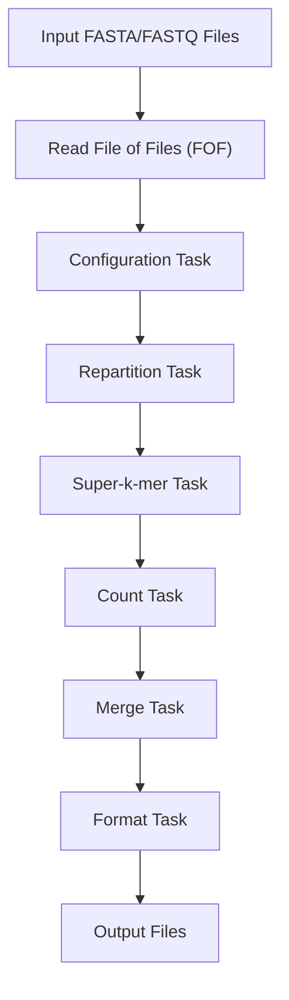

Notation:

- $K$ = `nb kmers` (max k-mer count)
- $S$ = `nb samples`
- $T$ = `nb threads`
- $P$ = `nb partitions`
- $M$ = `memory` (bytes)
- $f$ = `focus` (default $0.5$)
- $b = 8$ = bytes per k-mer (`byte_per_k`)
- $\alpha = 1.05$ = memory safety margin

`kmtricks` pipeline:

## Performances

`↑↑` dominant driver, `↑` moderate, `·` none or negligible, `↓` reduces the cost, `?` unknown.
Arrows give the direction of the effect on the metric, not its desirability.
Metrics that have an hard limit in system are in **bold**.

### Build
| metric \ parameter              | nb_samples | nb_kmers | nb_partitions | nb_threads |
| ------------------------------- | ---------- | -------- | ------------- | ---------- |
| **storage size**                | ↑↑         | ↑↑       | ·             | ·          |
| **open files** (kmtricks merge) | ↑↑         | ·        | ↑             | ↑↑         |
| **build peak RAM**              | .          | ↑↑       | ↓             | ↑↑         |
| build time                      | ↑↑         | ↑↑       | ?             | ↓          | 

### Query 
| metric \ parameter | nb_samples | nb_kmers (in query) | nb_partitions | nb_threads |
| ------------------ | ---------- | ------------------- | ------------- | ---------- |
| **peak RAM**       | ↑↑         | ↑↑                  | ?             | ?          |
| query time         | ↑↑         | ↑                   | ??            | ↓↓         |

## `nb_partitions` (computes $P$ from $K, M, T$)

$$
P = 
 \left\lceil \frac{K \cdot b \cdot \alpha \cdot T}{M} \right\rceil
$$

## `nb_open_files` (computes `files` dict from $T, P, S$)

$$
n_w = \max\left(1,\ \lfloor T \cdot f \rfloor \right)
$$

$$
\text{superk} = T \cdot P + n_w
$$

$$
\text{count} = 2T
$$

$$
\text{merge} = T (S + 1)
$$

:exclamation: Got this from Pierre: $\text{merge} = S \cdot \min(T, P)$

But for my heuristic current formula is simpler (using only $T$, when $T \gt P$ `merge` is only a bit overestimated so it's safe). In my opinion, merge is the most important to take into account since I don't see any cases where the other steps would exceed ulimit.

## memory and threads

Formulas are interdependent

### `max_memory` (computes $M$ from $K, T, P$)

$$
M = \alpha \cdot\frac{T}{P} \cdot b \cdot  K
$$

### `nb_threads` (computes $T$ from $K, M, P$)

$$
T = \max\left(1,\ \left\lfloor \frac{M}{\dfrac{K}{P} \cdot b \cdot \alpha} \right\rfloor \right)
$$

## Current procedure implemented in kmhelpers (`build_params.py`)

Additional notation:

- $R$ = `ram` (bytes)
- $F$ = `ulimit` (max open files)
- $N$ = `n_threads` (user thread cap)
- $S_{\text{total}}$ = total dataset sample count 

### `get_best_params`: maximize threads, then minimize partitions

> **Original approach.** The chunk size used to be fixed unconditionally at the largest value
> `ulimit` allows:
> 
> $$
> S = \min(F - 1,\ S_{\text{total}})
> $$
> 
> with no regard for $N$, which could leave threads unused whenever $\lfloor F/(S+1) \rfloor < N$.
> 
**Why it changed.** Priority was flipped to maximize threads first: shrink the chunk just
enough to unlock $N$ threads when the largest chunk caps them below $N$, trading more chunks
for full requested parallelism. 

:exclamation: Trade-off: maximize threads (new strategy) vs minimize number of chuncks (old strat)

1. Chunk size: as large as `ulimit` allows (fewest chunks), shrink it to the largest size that still fits $N$ threads in the merge stage ; gives $S$ satisfying $N(S+1) \le F$ such as

$$
S = \max(1, \min(\left\lfloor \dfrac{F}{N} \right\rfloor - 1,\ S_{\text{total}}))
$$

2. Hard thread ceiling, from the user cap and the merge-stage file limit ($T(S+1) \le F$):

$$
T_{\max} = \min\left(N,\ \left\lfloor \frac{F}{S+1} \right\rfloor \right)
$$

3. Walk $t$ down from $T_{\max}$ to $1$. For each $t$, take the RAM-minimum partitions via `nb_partitions`:

$$
P(t) = \left\lceil \frac{K \cdot b \cdot \alpha \cdot t}{R} \right\rceil
$$

then compute `nb_open_files` with $(t, P(t), S, f)$ and accept the first (largest) $t$ for which:

$$
\max\big(\text{superk}(t),\ \text{count}(t),\ \text{merge}(t)\big) \le F
$$

(Note: we always have max = `merge`)

The result is $T^ = t$, $P^ = P(t)$. Since `nb_partitions` already returns the RAM floor for a given thread count, the largest feasible $t$ paired with its minimum $P(t)$ is simultaneously the most-parallel and most '`ulimit` file-frugal' choice, so "maximize threads, then minimize partitions" has no conflicting trade-off. If no $t \in [1, T_{\max}]$ is feasible, raises `ValueError`.

The returned `params.samples` is the **per-chunk** count $S$, not $S_{\text{total}}$: when $S_{\text{total}} > S$, the caller runs $\lceil S_{\text{total}} / S \rceil$ sub-builds and merges them.

### `auto_params`: resolve system limits, then delegate and sanity-check

1. Parse the `limits` JSON for optional `ram`, `files`, `threads`, `focus`.
2. Any missing key falls back to a detected system limit scaled by $\sigma$: `get_available_ram`, `get_max_open_files`, `get_available_threads` (`pykmhelpers/core/resources.py`). `focus` falls back to $0.5$ if absent (not scaled by $\sigma$). $\sigma$ = `safety_margin` (default $1.0$), lower = safety factor applied to constraints
3. Call `get_best_params(K, R, S_total}, F, N, f)` as above.
4. Re-check the returned params against the resolved $R$, $F$, $N$ and raise `ValueError` if any is exceeded.

## Time (build and query)

Build time is (mostly) impacted by: 
- Number of samples
- Bloom filter size
- Disk speed ( RW )

Query time is (mostly) impacted by: 
- Number of files to open
- Number of k-mers to query
- Disk speed ( R )

## RAM at query time

TODO

## Storage

Storage mostly depends on value of $p$ (false positive rate).

 1 bits per k-mer for 0.619 <= p < 1.000
 2 bits per k-mer for 0.383 <= p < 0.619
 3 bits per k-mer for 0.237 <= p < 0.383
 4 bits per k-mer for 0.147 <= p < 0.237
 5 bits per k-mer for 0.091 <= p < 0.147
 6 bits per k-mer for 0.057 <= p < 0.091
 7 bits per k-mer for 0.035 <= p < 0.057
 8 bits per k-mer for 0.022 <= p < 0.035
 9 bits per k-mer for 0.014 <= p < 0.022
10 bits per k-mer for 0.010 <= p < 0.014

Bloom filter size in bits :
\begin{aligned} \mathrm{bf\_size} &= \left\lceil \frac{f \times K }{8} \right\rceil \times 8  \end{aligned}

with

$$f = \frac{-\ln(p)}{\ln(2)^2}$$

For false positive rate  $p=0.25$:
$$f \approx \mathbf{2.8854}$$

Which gives approximatively **3 bits per k-mer**.

Size in bytes for $S$ samples:

\begin{aligned} \mathrm{byte\_size} &= S \times \left\lceil \frac{f \times K}{8} \right\rceil \end{aligned}

- $K$ = `kmers` (max k-mer count)
